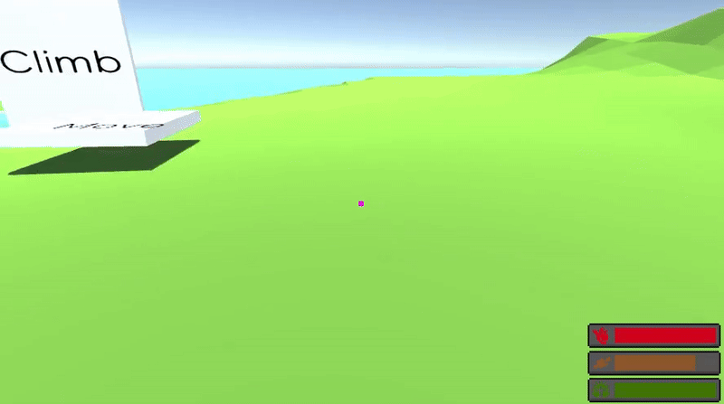
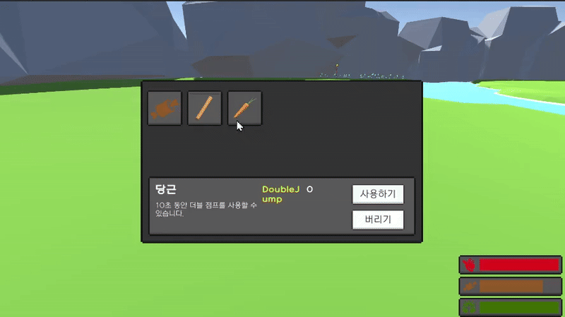
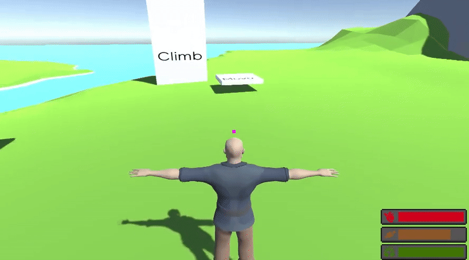
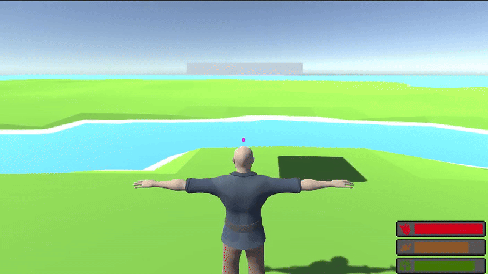
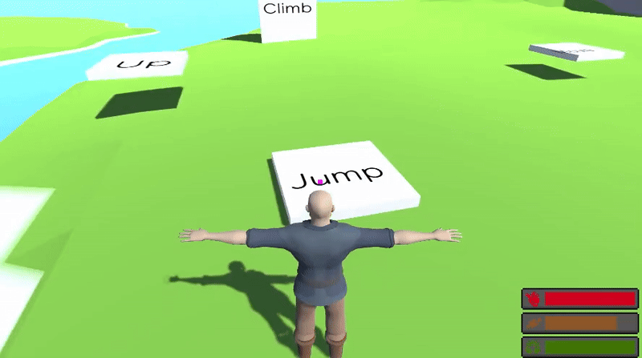

# 🌌 무한을 넘어 (Beyond Infinity)

**"아이템의 힘을 모아, 무한한 하늘을 향해 도약하라!"**  
수집, 활용, 그리고 상승 — 끊임없이 위로 향하는 당신의 여정을 시작하세요.

---

## 🎮 조작법

| 키 | 동작 |
|----|------|
| `WASD` | 캐릭터 이동 |
| `Space` | 점프 |
| `E` | 아이템 획득 |
| `Tab` | 인벤토리 열기/닫기 |

---

## 🧰 주요 기능

### 🎯 아이템 상호작용
- 화면 중앙에 아이템이 위치하면 정보가 표시됩니다.
- 아이템을 직접 선택해보고 전략적으로 활용하세요.

---

### 📦 인벤토리 시스템
- 아이템을 획득할 때마다 인벤토리 슬롯이 증가합니다.
- 아이템을 선택하면 상세 정보를 확인할 수 있습니다.

---

### ✨ 다양한 아이템 효과
- **더블 점프**, **스피드 상승**, **상태 회복** 등 다양한 효과를 가진 아이템들이 등장합니다.

---

### 🎥 시점 전환 기능
- `1인칭`과 `3인칭` 시점 중 원하는 시점으로 자유롭게 전환할 수 있습니다.

---

### 🛠️ 움직이는 플랫폼
- 플랫폼 위에 올라타면 캐릭터가 자연스럽게 따라 움직입니다.
- 정확한 발판 활용이 고도 상승의 핵심입니다.

---

### 🚀 점프대
- 점프대 위에 올라가면 캐릭터가 강하게 위로 튕겨 오릅니다.

---

### 🧗 벽타기 & 매달리기
- 벽이 가까이 있으면 자동으로 타거나 매달릴 수 있습니다.
- 수직 지형도 자유롭게 탐험하세요.

---

## 🛠️ 트러블 슈팅 & 개발 과정

개발 중 겪은 다양한 이슈들과 해결 과정을 정리했습니다.  
게임 제작 과정을 자세히 보고 싶다면 아래 문서를 확인하세요.

👉 [개발 문서 및 트러블슈팅 링크](https://three-333.tistory.com/426)
